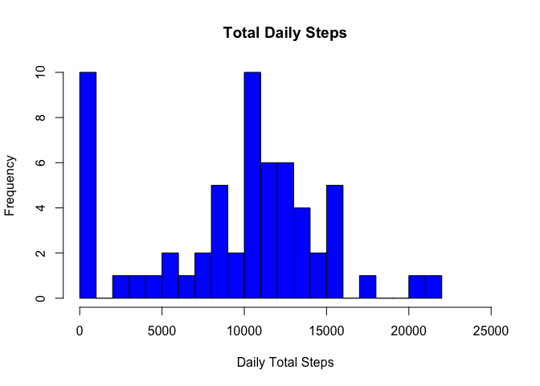
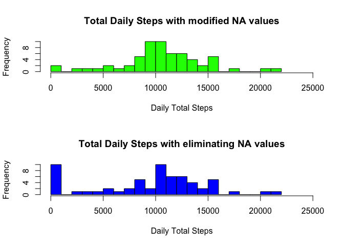
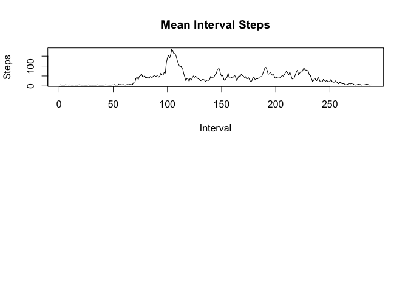
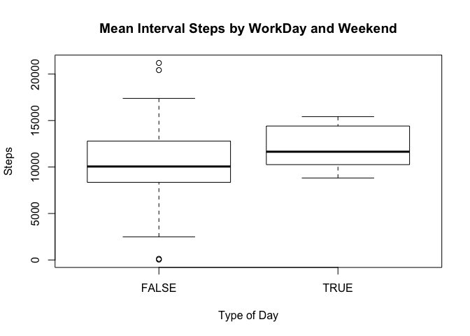

# Reproducible Research: Peer Assessment 1

```
## 
## Attaching package: 'lubridate'
## 
## The following objects are masked from 'package:chron':
## 
##     days, hours, minutes, seconds, years
## 
## The following objects are masked from 'package:data.table':
## 
##     hour, mday, month, quarter, wday, week, yday, year
```

```
## Warning: package 'dplyr' was built under R version 3.2.2
```

```
## 
## Attaching package: 'dplyr'
## 
## The following objects are masked from 'package:lubridate':
## 
##     intersect, setdiff, union
## 
## The following objects are masked from 'package:data.table':
## 
##     between, last
## 
## The following objects are masked from 'package:stats':
## 
##     filter, lag
## 
## The following objects are masked from 'package:base':
## 
##     intersect, setdiff, setequal, union
```

## Loading and preprocessing the data

The data does not include values for some days. (NA)

First read in the data and name the columns appropriately.


```r
stepdat <- read.table("./activity.csv",sep = ",",skip = 1, colClasses = c("numeric",
                                                                          "Date","numeric"))
cnames <- c("step","date","interval")
names(stepdat) <- make.names(cnames)
head (stepdat)
```

```
##   step       date interval
## 1   NA 2012-10-01        0
## 2   NA 2012-10-01        5
## 3   NA 2012-10-01       10
## 4   NA 2012-10-01       15
## 5   NA 2012-10-01       20
## 6   NA 2012-10-01       25
```

## What is mean total number of steps taken per day?
Determine the total for all 61 days and name the columns of the new dataframe "daytotal"
Eliminate days with NA values


```r
daytotal <- aggregate(list(stepdat$step), list(stepdat$date),sum, na.rm = TRUE)
head (daytotal)
```

```
##      Group.1
## 1 2012-10-01
## 2 2012-10-02
## 3 2012-10-03
## 4 2012-10-04
## 5 2012-10-05
## 6 2012-10-06
##   c.NA..NA..NA..NA..NA..NA..NA..NA..NA..NA..NA..NA..NA..NA..NA..
## 1                                                              0
## 2                                                            126
## 3                                                          11352
## 4                                                          12116
## 5                                                          13294
## 6                                                          15420
```

```r
names(daytotal) <- make.names(c("date","daily_total_steps"))
```

Make a histogram that shows a distribution of steps

 
Meadian and Mean values are observed in the table below:

```
##       date            daily_total_steps
##  Min.   :2012-10-01   Min.   :    0    
##  1st Qu.:2012-10-16   1st Qu.: 6778    
##  Median :2012-10-31   Median :10395    
##  Mean   :2012-10-31   Mean   : 9354    
##  3rd Qu.:2012-11-15   3rd Qu.:12811    
##  Max.   :2012-11-30   Max.   :21194
```
Determine number of NAs in the dataset

```
## [1] 2304
```

```
## [1] 2304
```

Approach 1 for handling missing values:
For days that have all NAs replace with the mean value for all 61 days
Mean is 9354 steps as observed in summary

To do that: 
Step 1: Replace 0s in daytotal with the 9354 (daily mean of total steps)


```
##         date daily_total_steps
## 1 2012-10-01                 0
## 2 2012-10-02               126
## 3 2012-10-03             11352
## 4 2012-10-04             12116
## 5 2012-10-05             13294
## 6 2012-10-06             15420
```

```
##   dailytotalsteps
## 1            9354
## 2             126
## 3           11352
## 4           12116
## 5           13294
## 6           15420
```

Combines the columns to the daytotal dataframe

```
##         date daily_total_steps dailytotalsteps
## 1 2012-10-01                 0            9354
## 2 2012-10-02               126             126
## 3 2012-10-03             11352           11352
## 4 2012-10-04             12116           12116
## 5 2012-10-05             13294           13294
## 6 2012-10-06             15420           15420
```
Create a histogram that compares approach 1 (removing NAs) to approach 2 (substitiuting NA w/ avg values)
 

```
##       date            daily_total_steps dailytotalsteps
##  Min.   :2012-10-01   Min.   :    0     Min.   :   41  
##  1st Qu.:2012-10-16   1st Qu.: 6778     1st Qu.: 9354  
##  Median :2012-10-31   Median :10395     Median :10395  
##  Mean   :2012-10-31   Mean   : 9354     Mean   :10581  
##  3rd Qu.:2012-11-15   3rd Qu.:12811     3rd Qu.:12811  
##  Max.   :2012-11-30   Max.   :21194     Max.   :21194
```
Notice the change in median and mean values from the 2 approaches.

```
##       date            daily_total_steps dailytotalsteps
##  Min.   :2012-10-01   Min.   :    0     Min.   :   41  
##  1st Qu.:2012-10-16   1st Qu.: 6778     1st Qu.: 9354  
##  Median :2012-10-31   Median :10395     Median :10395  
##  Mean   :2012-10-31   Mean   : 9354     Mean   :10581  
##  3rd Qu.:2012-11-15   3rd Qu.:12811     3rd Qu.:12811  
##  Max.   :2012-11-30   Max.   :21194     Max.   :21194
```

## What is the average daily activity pattern?

Q2: Convert the intervals to factors so that we can see which interval has largest number of steps.

```
## 'data.frame':	17568 obs. of  3 variables:
##  $ step    : num  NA NA NA NA NA NA NA NA NA NA ...
##  $ date    : Date, format: "2012-10-01" "2012-10-01" ...
##  $ interval: Factor w/ 288 levels "0","5","10","15",..: 1 2 3 4 5 6 7 8 9 10 ...
```
Above, we notice 288 levels

Calculate the mean for each interval across all days.
However since, few days have no data I will replace "NAs" for those days with the 
average of daily datasteps (9354) divided by the number of intervals (288)


Question 2 - First using weekdays function, determine the days of the week for all 61 days.


Create the timeline graph across intervals
 

## Are there differences in activity patterns between weekdays and weekends?
Quesstion 2 - Create factors from dayofweek variable, so that we can do analysis.
First identify which day of the week.

```
## 'data.frame':	61 obs. of  5 variables:
##  $ date             : Date, format: "2012-10-01" "2012-10-02" ...
##  $ daily_total_steps: num  0 126 11352 12116 13294 ...
##  $ dailytotalsteps  : num  9354 126 11352 12116 13294 ...
##  $ dayofweek        : chr  "Monday" "Tuesday" "Wednesday" "Thursday" ...
##  $ weekend          : logi  FALSE FALSE FALSE FALSE FALSE TRUE ...
```

Calculate the total steps for weekend or weekday and compare workkday (FALSE) and weekend (TRUE)

```
##       meansteps
## FALSE  10067.56
## TRUE   12025.00
```

 
